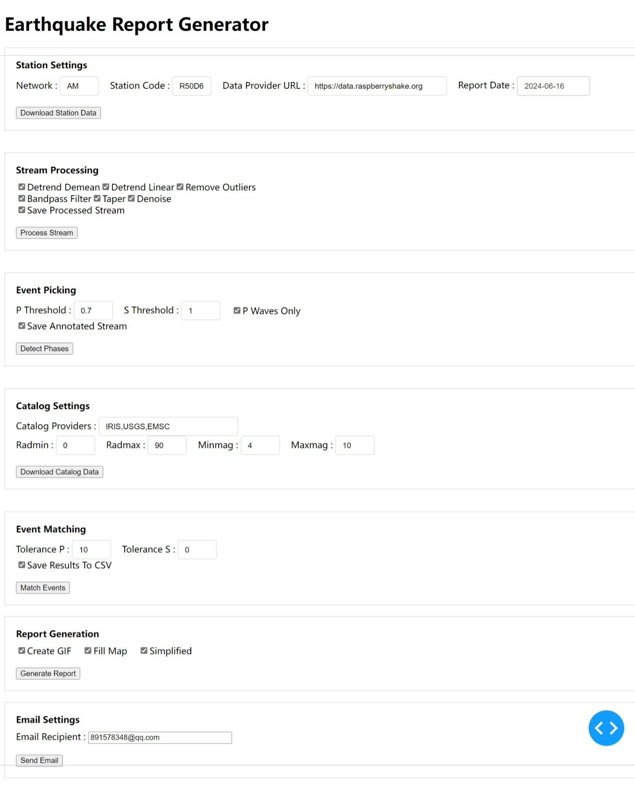

# Automated Earthquake Identification And Notification Systems
This repository is for my dissertation project of Durham MDS.  

## Demo Usage
See main.ipynb and for report_generation.ipynb for latest progress. 

## Flowchart of Project/ Code Design
This reflect my current design and progress and will be updated constantly.
 

## Progress Log
### 2024-04-18  
1. Built a functional DataDownload.py for downloading seismic data from specified station and date. 
2. Moving on to seismic data preprocessing in DataProcessing.py.  
3. Doing more background reading and improving overall code design. 

### 2024-04-19  
1. Still working on preprocessing and denoising.  
2. Looking for best parameters to produce clean seismic streams. 
3. Starting to build EventIdentification.py for earthquake identification using STA/LTA method from processed seismic data. 
4. Added an interactive Jupyter notebook version of main.py for testing and playing around. 

### 2024-04-21  
1. FDSNWS service still unavailable. Used https://data.raspberryshake.org for data.  
2. Improved codes for outliers/ extreme values removal.   
3. Working on implementing a denoising algorithm.  
4. Added a util.py for utility functions like getting lat and long of a given station.   

### 2024-04-23  
1. Added a predict_arrivals() to predict arrival times of earthquakes identified from daily stream.  
2. Planning to implement a module in the future to analysis noise pattern and output produce more "tailored" parameters for denoising.  
3. Working on finding the best parameters for STA/ LTA window and threshold to better identify earthquake events.  

### 2024-04-25  
Made major changes to overall designs:  
1. Will attempt to identify earthquakes within predicted time windows first instead of identifying events from entire day's stream. 
2. A DataFrame will be used to store all earthquake events to maintain consistency of formatting. 
3. Combination of "catalogued" and "detected" column values are used to represent the state of the event. 
4. Refer to flowchart for more details of code design. 

### 2024-04-26  
1. Download function now download from 23:00 T-1 to 01:00 T+1, while catalogue returns events from 23:30 T-1 to 00:30 T+1 to avoid predicted time windows falling on empty stream.  
2. Need to find a way to make sure event identified within time window is indeed the one we are looking for. 
3. Still working on finding best parameters for preprocessing/denosing. 

### 2024-04-28  
1. Improved overall code logic.   
2. Redesigned flowchart for better representation of project design. Seprated code module design from flowchart. 
3. Added "detected_start" column to DataFrame for storing observed starting time for catalogued earthquakes.  
4. Added functions to plot predicted times and identified times on the waves for better visualization.  Example:  
 
5. Added a basic function matching detected events with catalogued earthquakes by comparing times.   
6. Working on finding best parameters for STA/LTA and preprocessing/denosing. 
7. Planning on building a real-time script to report latest events by continously monitoring a catalogue. This will generate emails for individual events captured on local stations 

### 2024-04-29  
1. Changed back to the more efficient way of analyzing the daily stream as whole. 
2. The program now generates two dataframes: one for catalogued events and another for detected events.Then it performs a matching and merging process on these events.  
3. Might try something like iterating over a range parameters to find the best parameter combinations to maximize the chance of detecting the events listed in the catalogue.  

### 2024-04-30  
Major changes:   
1. Implemented pre-trained deep learning models from [SeisBench](https://github.com/seisbench/seisbench) for denosing and event detection/ phase picker. Seems to work quite well (and fast).   
2. Pre-trained models could identify wave phases and produce confidence scores for the predictions, so we have a more precise way of match and merging the events.  
Other changes:   
3. Now the codes request events from multiple catalogues in case service denied/ down. If all failed, it will sleep for 60s and retry.   

### 2024-05-01  
1. Tried different pre-trained models for phase picking.   
2. Optimized existig codes for post-processing.    

### 2024-05-02  
1. Improved existing codes and fixed some issues.  
2. Added GPU support. If CUDA is available, models will run on GPU for acceleration.    
3. Catalogues requested are saved to QuakeXML file. It will check if it already exists before requesting.  
4. Added probability plotting of picked phases when visualizing the matched event.  
   Example:    
 

### 2024-05-04 
1. DataFrame now contains unique event ID, depth, epicentral distance for catalogued events.   
2. Added plot function for showing catalogued events and station on globe map. Has the option to toggle map filling.  
   Examples of map filling on/off:  
 
 
3. Functions for downloading mseed files and catalogues now have the option to download again and overwrite already existing files.   
4. Optimized a lot of existing codes. Deleted unused and old functions.  

### 2024-05-05  
1. Now all processed streams, phase picking predictions/ annotations and results will be saved to files. 
2. The files saved will used for generating contents for the email notifications or build a database in the future.   
3. Added contentGeneration.ipynb for testing building contents for report/email. 
See this [PDF](generated/ExampleEmailContent.pdf) for example for email content built using HTML. 

Next steps: Improve exceptions catching and file management. 

### 2024-05-06  
1. Kept working on codes for building HTML.  
2. Added report_generation.ipynb to demonstrate content generation using files produced from main.ipynb. See Noteebook and this [PDF](generated/ExampleEmailContent.pdf) for latest example. 
2. Worked on tweaking parameters for requesting catalogues to maximize chance of matching events. 
3. Fixed a number of small bugs.  
4. Updated flowchart to reflex latest code design.  

### 2024-05-07  
Just found out that P waves are usually much more easier to be detected than S waves with higher accuracy and lower prediction time error. Added feature to set different threshold and tolerance values for P and S when filtering picking confidence and matching events.  
Added spectrogram plotting for the matched events. Now the report shows waveform(with predicted and picked time marked) + prediction confidence(probability) + spectrogram. Example:     
Added function for email message preparation, which prepare emails content by embedding images as MIMEImage objects to message.  
Added function for sending the emails to designated recipient using SMTP.  
Email sending function is working but Outlook and Gmail do not render it correctly for security reasons. Tested in other email clients and works as expected. 

### 2024-05-08  
1. Utilized a new GitHub repo dedicated for image hosting to HTML with embedded images not rendering correctly. 
2. Improved catalogue map plot: Now detected and undetected events are shown in different shapes. Legend also shows numbers for each. 
3. Introducing a "simplified" mode when generating report. Hiding a few technical details.  
4. Streamlined codes for reading previously produced files and generating reports.  
5. Added columns for calculated time errors between predicted and detected values in DataFrame after match-n-merge.  

### 2024-05-10  
1. Added an option to generate the catalogued map plot as a GIF, which shows detected events and undetcted events on seperate frames to avoid overlapping.  
2. Working on plot of series of waves for same event from different stations. Workingo on finding well placed stations that holds the data we need.   

### 2024-06-14  
**Total reconstruction** of the program to employ a complete object-oriented approach.  
The program now utilizes Station, Catalog, Earthquake, and Report objects for a clearer and more organized operation. 
This significantly increases the code's extensibility, readability, and maintainability, and makes a better infrastructure for future development. 
1. Station class: 
   Information: Network, Station code, URL, Latitude and longitude, Report date, Data folder path, Report folder path 
   Methods: Fetch coordinates, Download data, Manage data paths and report folders 
2. Catalog Class: 
   Information: Latitude and longitude (from Station), Date, Minimum/ maximum radius and magnitude, events, provider 
   Methods: Request earthquake data from multiple providers, Process catalog data into Earthquake objects, Generate a summary of the catalog 
3. Earthquake Class: 
   Information: Unique ID, Provider, Event ID, Time, Lat and long, Magnitude and type, Depth, Epicentral distance, Predicted and detected P/S wave arrival times, prediction confidence and time errors, Catalogued and detected status, Plot path 
   Methods: Calculate arrival times, Update errors, Generate detailed plots for each event 
4. Report Class: 
   Information: Station object, List of Earthquake objects, Processed and annotated stream, Simplified and P-only modes, Fill map and create GIF modes, Compiled report HTML path 
   Methods: Generate catalog plots, Generate detailed event plots, Compile HTML report, Update HTML with images, Send report via email, Generate and send report 
   
Other Fix: 
1. Removed redundant codes. 
2. Decouple interdependencies between py files. 

Next Steps: 
1. Better CSS for report html 
2. Add a method for producing a PDF version of report 
3. Make another attempt at achieving the “moveout” effect in arrival time with increaseing distance from the earthquake 
4. Make a basic GUI as front end  
   

### 2024-06-16  
1. Now the program has a basic web-base GUI created using Dash. 
 
 
2.Further reconstruction and optimization using an object-oriented logic. 
The program's logic is now much clearer, with all information being passed through objects and their interactions. 
All operations are executed as methods of these objects, ensuring a more organized and maintainable code structure. 
Completely new sturcture from ground up: 
 
 
Next Steps: 
1. Better CSS for report html 
2. Add a method for producing a PDF version of report 
3. Make another attempt at achieving the “moveout” effect in arrival time with increaseing distance from the earthquake. 
4. ~~Make a basic GUI as front end~~  
5. Implement mode selection in GUI allowing non-expert user to one-click generate report using default optimize settings. 

