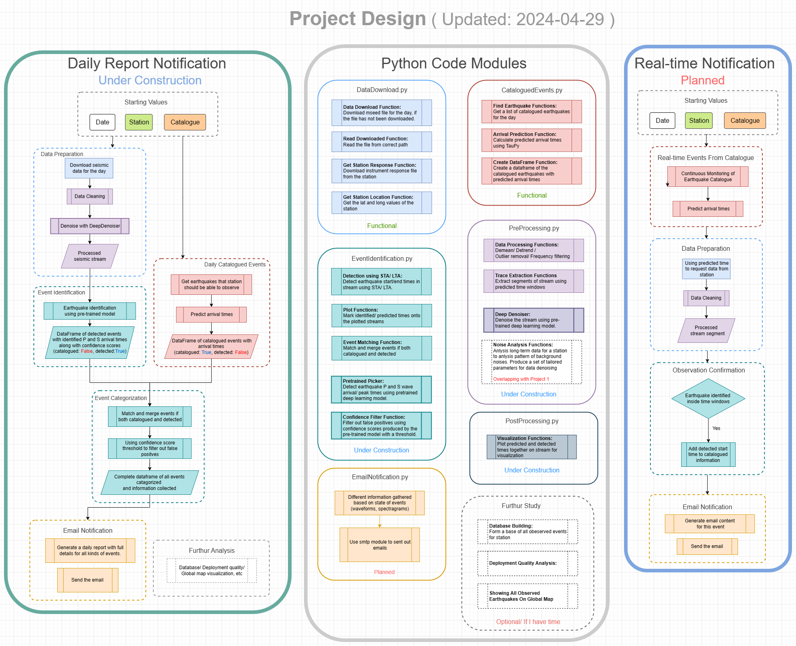
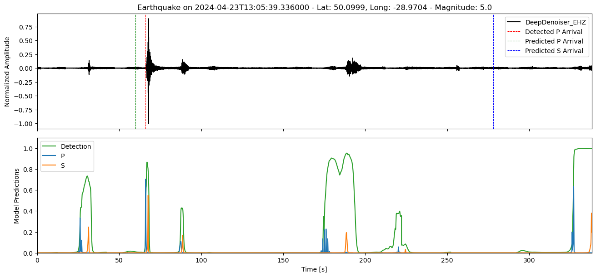
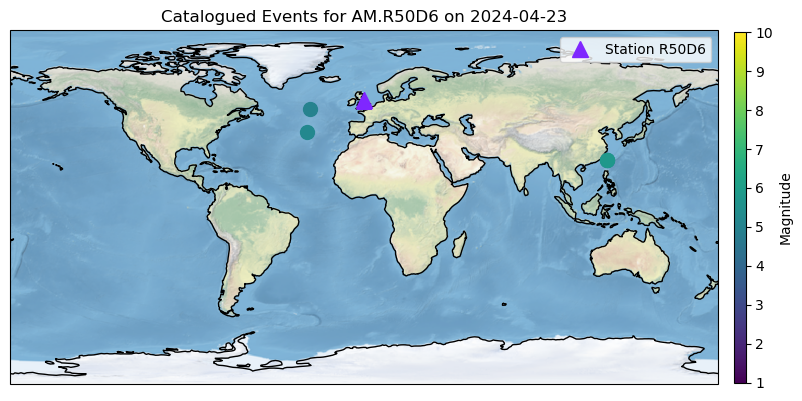
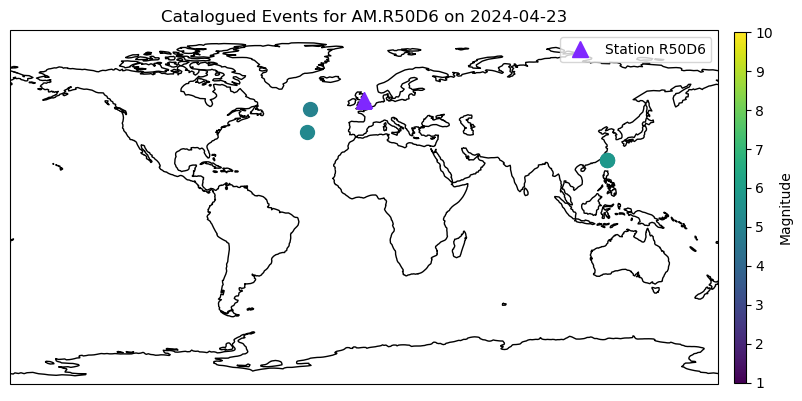

# Automated Earthquake Identification And Notification Systems
This repository is for my dissertation project of Durham MDS.  

## Demo Usage
Run interactiveMain.ipynb for examples of latest progress. 

## Flowchart of Project/ Code Design
This reflect my current design and progress and will be updated constantly.
 

## Progress Log
### 2024-04-18  
1. Built a functional DataDownload.py for downloading seismic data from specified station and date. 
2. Moving on to seismic data preprocessing in DataProcessing.py.  
3. Doing more background reading and improving overall code design. 

### 2024-04-19<b/>  
1. Still working on preprocessing and denoising.  
2. Looking for best parameters to produce clean seismic streams. 
3. Starting to build EventIdentification.py for earthquake identification using STA/LTA method from processed seismic data. 
4. Added an interactive Jupyter notebook version of main.py for testing and playing around. 

### 2024-04-21<b/>  
1. FDSNWS service still unavailable. Used https://data.raspberryshake.org for data.  
2. Improved codes for outliers/ extreme values removal.   
3. Working on implementing a denoising algorithm.  
4. Added a util.py for utility functions like getting lat and long of a given station.   

### 2024-04-23<b/>  
1. Added a predict_arrivals() to predict arrival times of earthquakes identified from daily stream.  
2. Planning to implement a module in the future to analysis noise pattern and output produce more "tailored" parameters for denoising.  
3. Working on finding the best parameters for STA/ LTA window and threshold to better identify earthquake events.  

### 2024-04-25<b/>  
Made major changes to overall designs:  
1. Will attempt to identify earthquakes within predicted time windows first instead of identifying events from entire day's stream. 
2. A DataFrame will be used to store all earthquake events to maintain consistency of formatting. 
3. Combination of "catalogued" and "detected" column values are used to represent the state of the event. 
4. Refer to flowchart for more details of code design. 

### 2024-04-26<b/>  
1. Download function now download from 23:00 T-1 to 01:00 T+1, while catalogue returns events from 23:30 T-1 to 00:30 T+1 to avoid predicted time windows falling on empty stream.  
2. Need to find a way to make sure event identified within time window is indeed the one we are looking for. 
3. Still working on finding best parameters for preprocessing/denosing. 

### 2024-04-28<b/>  
1. Improved overall code logic.   
2. Redesigned flowchart for better representation of project design. Seprated code module design from flowchart. 
3. Added "detected_start" column to DataFrame for storing observed starting time for catalogued earthquakes.  
4. Added functions to plot predicted times and identified times on the waves for better visualization.  Example:  
 
5. Added a basic function matching detected events with catalogued earthquakes by comparing times.   
6. Working on finding best parameters for STA/LTA and preprocessing/denosing. 
7. Planning on building a real-time script to report latest events by continously monitoring a catalogue. This will generate emails for individual events captured on local stations 

### 2024-04-29<b/>  
1. Changed back to the more efficient way of analyzing the daily stream as whole. 
2. The program now generates two dataframes: one for catalogued events and another for detected events.Then it performs a matching and merging process on these events.  
3. Might try something like iterating over a range parameters to find the best parameter combinations to maximize the chance of detecting the events listed in the catalogue.  

### 2024-04-30<b/>  
Major changes:   
1. Implemented pre-trained deep learning models from [SeisBench](https://github.com/seisbench/seisbench) for denosing and event detection/ phase picker. Seems to work quite well (and fast).   
2. Pre-trained models could identify wave phases and produce confidence scores for the predictions, so we have a more precise way of match and merging the events.  
Other changes:   
3. Now the codes request events from multiple catalogues in case service denied/ down. If all failed, it will sleep for 60s and retry.   

### 2024-05-01<b/>  
1. Tried different pre-trained models for phase picking.   
2. Optimized existig codes for post-processing.    

### 2024-05-02<b/>  
1. Improved existing codes and fixed some issues.  
2. Added GPU support. If CUDA is available, models will run on GPU for acceleration.    
3. Catalogues requested are saved to QuakeXML file. It will check if it already exists before requesting.  
4. Added probability plotting of picked phases when visualizing the matched event.  
   Example:    
 

### 2024-05-04<b/>  
1. DataFrame now contains unique event ID, depth, epicentral distance for catalogued events.   
2. Added plot function for showing catalogued events and station on globe map. Has the option to toggle map filling.  
   Examples of map filling on/off:  
 
 
3. Functions for downloading mseed files and catalogues now have the option to download again and overwrite already existing files.   
4. Optimized a lot of existing codes. Deleted unused and old functions.   

