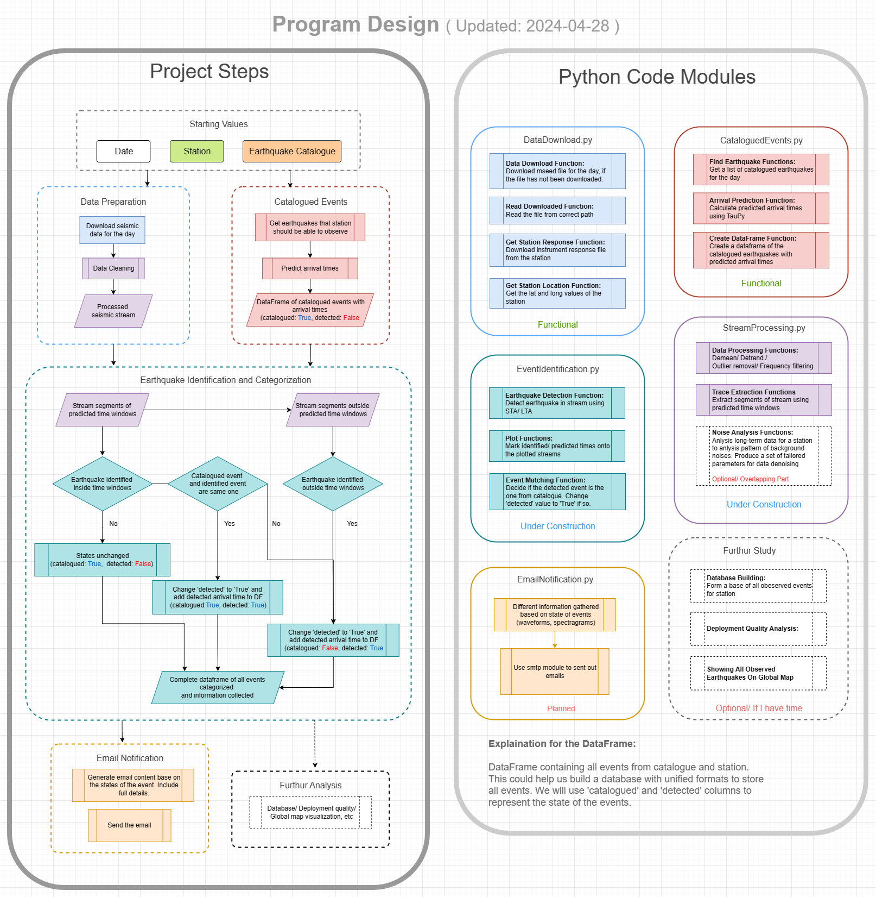
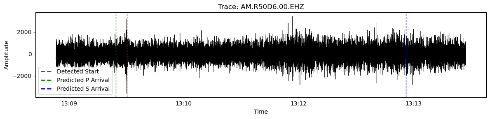

# Automated Earthquake Identification And Notification Systems
This repository is for my dissertation project of Durham MDS.  

## Usage
Run interactiveMain.ipynb for examples of latest progress. 

## Flowchart of Project/ Code Design
This reflect my current design and progress and will be updated constantly.
 

## Progress Log
### 2024-04-18  
Built a functional DataDownload.py for downloading seismic data from specified station and date. 
Moving on to seismic data preprocessing in DataProcessing.py.  
Doing more background reading and improving overall code design. 

### 2024-04-19<b/>  
Still working on preprocessing and denoising.  
Looking for best parameters to produce clean seismic streams. 
Starting to build EventIdentification.py for earthquake identification using STA/LTA method from processed seismic data. 
Added an interactive Jupyter notebook version of main.py for testing and playing around. 

### 2024-04-21<b/>  
FDSNWS service still unavailable. Used https://data.raspberryshake.org for data.  
Improved codes for outliers/ extreme values removal.   
Working on implementing a denoising algorithm.  
Added a util.py for utility functions like getting lat and long of a given station.   

### 2024-04-23<b/>  
Added a predict_arrivals() to predict arrival times of earthquakes identified from daily stream.  
Planning to implement a module in the future to analysis noise pattern and output produce more "tailored" parameters for denoising.  
Working on finding the best parameters for STA/ LTA window and threshold to better identify earthquake events.  

### 2024-04-25<b/>  
Made major changes to overall designs:  
1. Will attempt to identify earthquakes within predicted time windows first instead of identifying events from entire day's stream. 
2. A DataFrame will be used to store all earthquake events to maintain consistency of formatting. 
3. Combination of "catalogued" and "detected" column values are used to represent the state of the event. 
4. Refer to flowchart for more details of code design. 

Download function now download from 23:00 T-1 to 01:00 T+1, while catalogue returns events from 23:30 T-1 to 00:30 T+1 to avoid predicted time windows falling on empty stream.  

Need to find a way to make sure event identified within time window is indeed the one we are looking for. 
Still working on finding best parameters for preprocessing/denosing. 

### 2024-04-28<b/>  
Improved overall code logic.   
Redesigned flowchart for better representation of project design. Seprated code module design from flowchart. 
Added "detected_start" column to DataFrame for storing observed starting time for catalogued earthquakes.  
Added functions to plot predicted times and identified times on the waves for better visualization.  Example:  
 
Added a basic function matching detected events with catalogued earthquakes by comparing times.   
Working on finding best parameters for STA/LTA and preprocessing/denosing. 
Close to finish building up a skeleton of the project (hopefully).  

