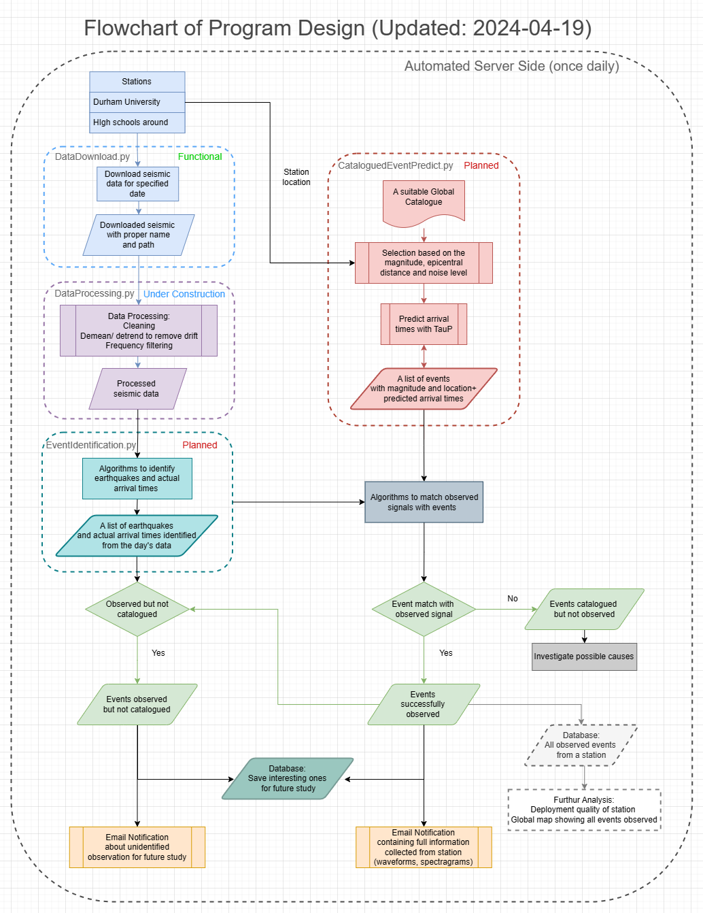

# Automated Earthquake Identification And Notification Systems
This repository is for my dissertation project of Durham MDS. 

This flowchart showing below would reflect my current design and progress.
It will be updated constantly.
 

# Progress Log
<b>2024-04-18<b/>  
Built a functional DataDownload.py for downloading seismic data from specified station and date. 
Moving on to seismic data preprocessing in DataProcessing.py.  
Doing more background reading and improving overall code design. 
 
<b>2024-04-19<b/>  
Still working on preprocessing and denoising.  
Looking for best parameters to produce clean seismic streams. 
Starting to build EventIdentification.py, which is for earthquake identification using STA/LTA method from processed seismic data. 
